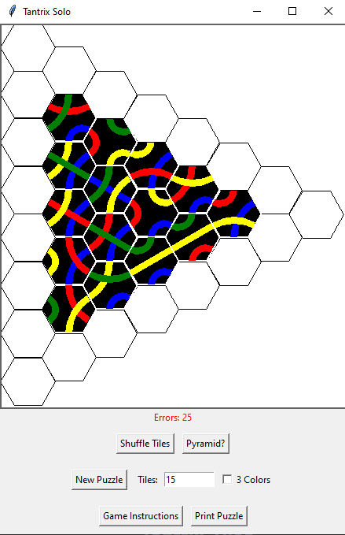
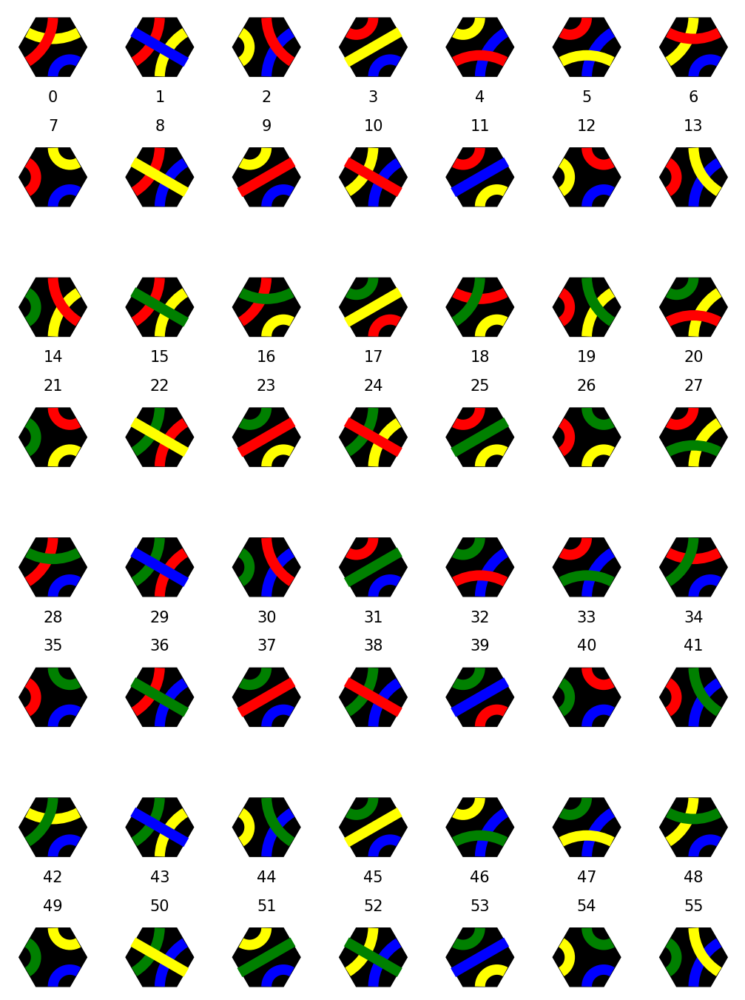
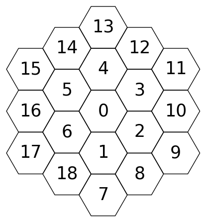
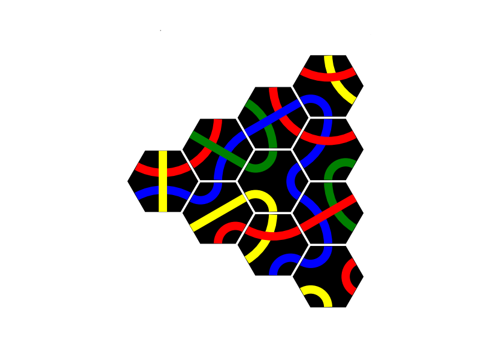

# Tantrix Solo Puzzle Game

## Overview

This project is an implementation of a solo [Tantrix](https://tantrix.com) game with a graphical user interface (GUI). It is based on the work by [Henk Westerink](https://github.com/hwesterink), who provided the basic GUI [implementation](https://github.com/hwesterink/PythonCourseraRice). The objective of the game is to place the Tantrix tiles in such a way that the edges of adjacent hexagonal tiles match in color. This project provides an easy way to start and play Tantrix games.

It works together with [this](https://github.com/LE-428/Tantrix) project, which is an implementation of a solver for Tantrix puzzles based on an algorithm called simulated annealing. You can use the 'Print Puzzle' button in the GUI, which will return a representation (see below) of the current board to the console that can be used to start the solving algorithm.

## Layout

Click the 'Game Instructions' button to access the instructions and features of this game



## Starting the Game

To start the game, open a terminal or console and type:

```bash
python start_game.py
```

You can start a custom game with a certain choice of tiles with (replace `PUZZLE` with a string representing a tile arrangement, see below)

```bash
python start_game.py -p PUZZLE
```

If you need help or additional information on how to use the file, you can access the help menu by running:

```bash
python start_game.py -h
```

## Files

- **start_game.py**: The main entry point that can be executed directly from the console to start the game. Use `python start_game.py` to start the game.
- **solo_tantrix.py**: This file contains the logic and functions for the solo Tantrix game, including the rules and tile management.
- **tantrix_gui.py**: This file provides the graphical user interface (GUI) for the game, allowing visual interaction with the tiles.
- **hexagon_functions.py**: This file contains mathematical functions and utilities to calculate positions and interactions of the hexagonal tiles.

## Tantrix Tiles

**The 56 Tantrix tiles, grouped into 4 sets of 3 colors, with their corresponding numbers:**



**Visualization of the board field enumeration, ascending counter-clockwise per 'ring' around the center:**



**Example puzzle with representation:**

- [16, 6, 5, 1, 0, 4, 8, 2, 3, 12] (fields)
- [8, 3, 36, 6, 54, 29, 7, 38, 32, 0] (tiles)
- ['121323', '112332', '141343', '113232', '114422', '313414', '112233', '131434', '131443', '112323'] (tile codes: (1: blue, 2: yellow, 3: red, 4: green), visiting the hexagon edges counter-clockwise)
- [1, 3, 0, 0, 5, 5, 3, 2, 3, 1] (tile orientation: orientation 0 is as seen in the image with the 56 tiles above, rotating a tile by 60 degrees clockwise increases the orientation by 1)

Combined representation:

- [[fields], [tiles], [tile codes], [orientations]], 
- [[fields], [tiles], [orientations]] or 
- [[tiles], [tile codes], [orientations]] if fields = [0, 1, 2, 3, 4, 5, 6] ('flower puzzle').



see [here](https://www.jaapsch.net/puzzles/tantrix.htm) for more information about Tantrix puzzles

---
